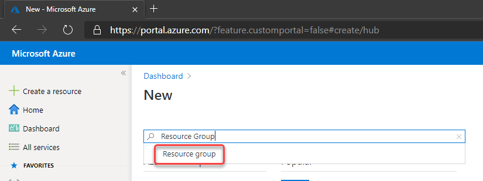
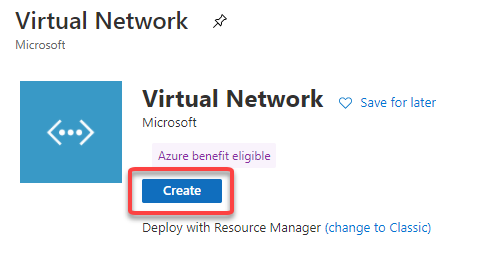
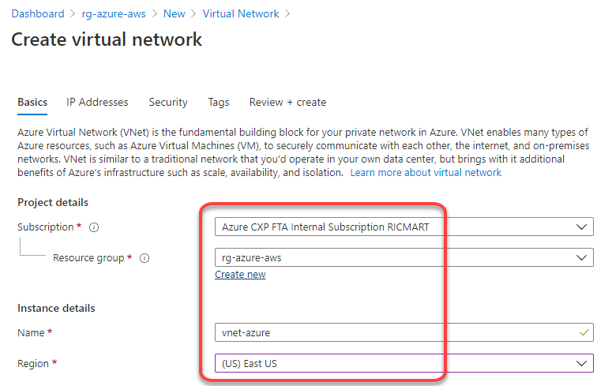

# How to create a VPN between Azure and AWS using only managed solutions

What if you can stablish a connection between Azure and AWS using their managed solutions instead to have to use virtual machines? Did you know that since the beginning of 2019 you could do this?

Yes, you can! This is because since [February/2019](https://aws.amazon.com/about-aws/whats-new/2019/02/aws-site-to-site-vpn-now-supports-ikev2/)  AWS started to support IKEv2 allowing them to work both as initiator and responder mode, like Azure does. 

That said, if before you had to use an appliance or virtual machine acting as VPN Server on the other side when using the AWS Virtual Private Gateway, now you don't need anymore. You can simply connect the AWS Virtual Private Gateway with the Azure VPN Gateway directly without worry to manage IaaS resources like virtual machines.

So in this article I'll show to you how to setup this. Below the draw of our lab:

## Configuring Azure 

1. Create a resource group on Azure to deploy the  resources on that:

Choose the subscription, the name and the region to be deployed:

2. Create a Virtual Network and a subnet

Define the subscription, resource group, name and region to be deployed:

Set the address space for the virtual network and for the subnet. 
Here I'm defining the virtual network address space to 172.10.0.0/16, changing the "default" subnet name to " subnet-01" and defining the subnet address range to 172.10.1.0/24:

	
3. Create the VPN Gateway

The Azure VPN Gateway is a resource composed of 2 or more VM's that are deployed to a specific subnet called Gateway Subnet where the recommendation is to use a /27. He contain routing tables and run specific gateway services. Note that you can't access those VM's.

 To create, go to your Resource Group, then click to **+ Add**
